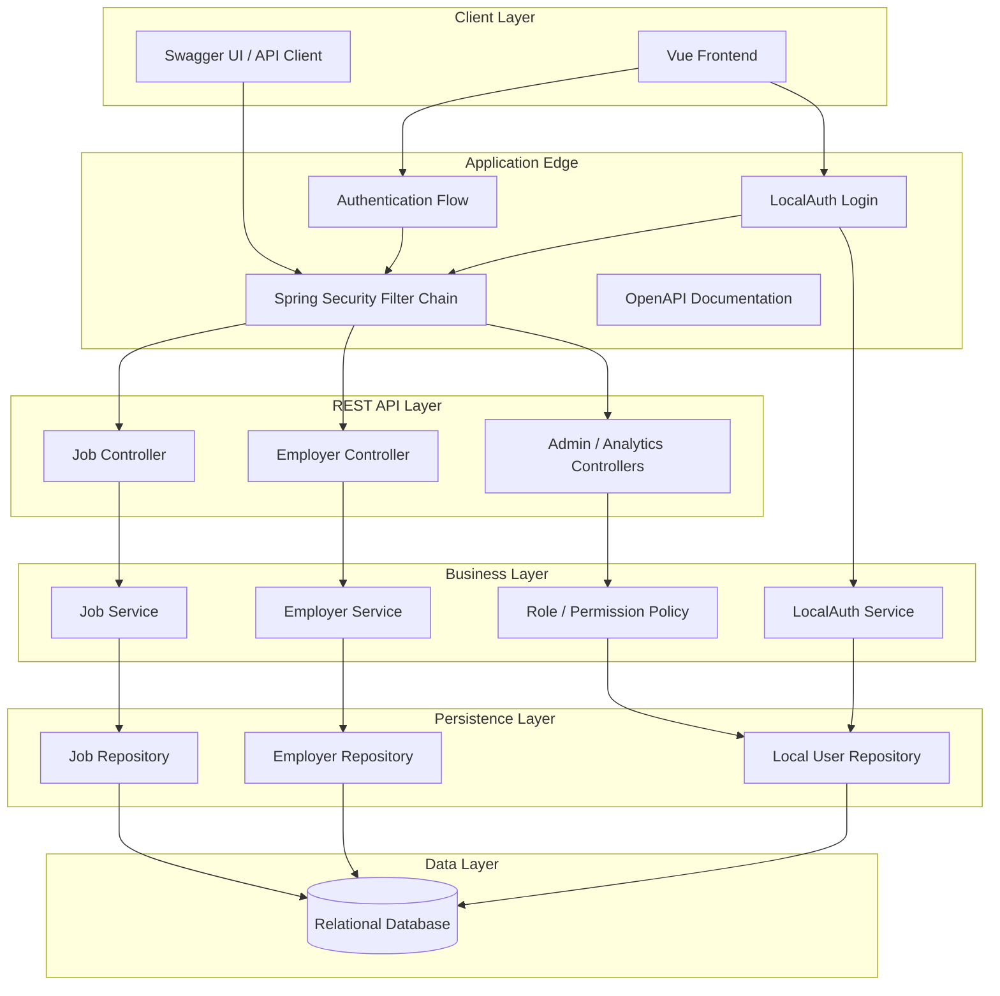
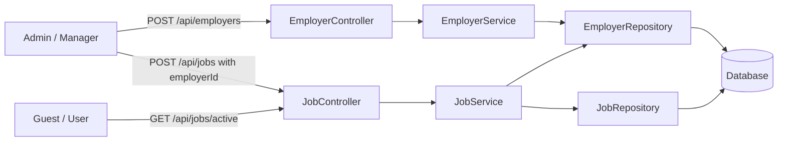
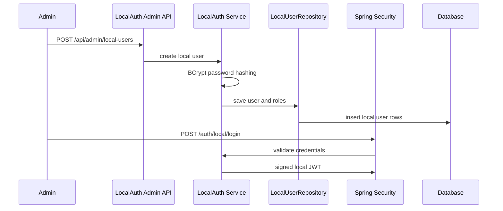

# Backend Architecture

SmartRecrutare is a Spring Boot backend using REST controllers, DTOs, service-layer transactions, JPA repositories, OAuth2/JWT security, LocalAuth JWT support, and OpenAPI annotations.

## System Diagram

Auth0 remains the cloud identity-provider path. LocalAuth is a database-backed path for non-cloud users and shares the same Spring authority model after JWT validation.

## Layer Responsibilities

REST controllers:

- Accept HTTP requests.
- Apply route-level and method-level authorization.
- Validate request DTOs.
- Return response DTOs and HTTP status codes.

Services:

- Hold business workflow and authorization-independent rules.
- Use `@Transactional` for writes.
- Use `@Transactional(readOnly = true)` for reads.

Repositories:

- Encapsulate JPA persistence.
- Expose only query methods needed by services.

Security:

- Enforces public/private route boundaries in `SecurityFilterChain`.
- Enforces business permissions through `@PreAuthorize`.
- Converts JWT roles to internal Spring authorities.
- Routes JWT decoding between Auth0 and LocalAuth by token issuer.

LocalAuth:

- Stores only BCrypt password hashes.
- Issues short-lived local JWT bearer tokens when explicitly enabled.
- Keeps local user management under admin-only endpoints.
- Applies employer ownership checks for local managers.

## Employer and Job Workflow

## LocalAuth Workflow

## Hardening Decisions

- Public browsing is limited to active job listings.
- Administrative employer and job reads require elevated read roles.
- Job and employer writes require admin or manager.
- Local managers can manage only assigned employers and jobs for those employers.
- Deletes are admin-only.
- Safe analytics reads are available to admin, auditor, and governmental users.
- No local production user seeding was added.

## Deferred Improvements

- Soft delete is not implemented because the current audit base does not define deletion state.
- Database migrations are still deferred because the project currently uses Hibernate auto DDL.
- Refresh tokens and account lockout counters are not implemented yet; LocalAuth currently issues access tokens only and supports manual locked/enabled flags.
