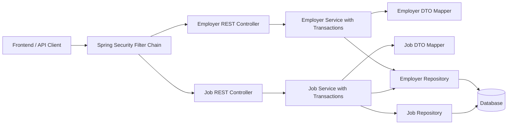
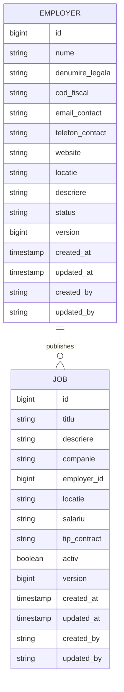

# SmartRecrutare Employer and Job Workflow

This document describes the backend workflow for employers and jobs after the employer domain was introduced.

## Runtime Architecture

## Domain Relationship

`Job.companie` remains as a legacy/display field for compatibility. New DTO-based job creation and update require `employerId`.

## API Workflow

1. Admin or manager authenticates through the configured Spring Security/OAuth2 resource server.
2. Admin or manager creates an employer with `POST /api/employers`.
3. Admin or manager creates a job linked to that employer with `POST /api/jobs` and `employerId`.
4. Users or guests can read public/active jobs according to the security rules configured in the security layer.
5. Auditor or governmental users can inspect records according to the role rules configured in a later security pass.

## Endpoints

Employer API:

- `GET /api/employers`
- `GET /api/employers/{id}`
- `POST /api/employers`
- `PUT /api/employers/{id}`
- `DELETE /api/employers/{id}`

Job API:

- `GET /api/jobs`
- `GET /api/jobs/{id}`
- `POST /api/jobs`
- `PUT /api/jobs/{id}`
- `DELETE /api/jobs/{id}`
- `GET /api/jobs/active`
- `GET /api/jobs/cauta?titlu=java`

## Audit

`Employer` and `Job` inherit audit metadata from the existing `AuditableEntity` base class:

- `version`
- `createdAt`
- `updatedAt`
- `createdBy`
- `updatedBy`

No second audit model is introduced.
