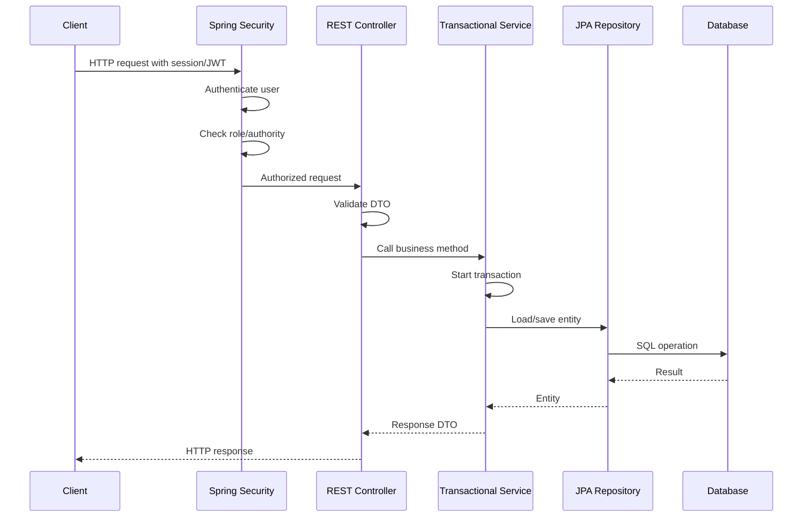

# Security RBAC Workflow

This document describes the role-based access control currently implemented in SmartRecrutare.

## Authentication Model

SmartRecrutare uses the existing Spring Security OAuth2 resource-server configuration for Auth0 JWT bearer tokens and now also supports `LocalAuth` JWT bearer tokens for users stored in the application database. Both paths feed the same Spring Security authorization model.

No local production users, plaintext passwords, or hardcoded admin accounts were added. LocalAuth is disabled by default and requires an explicit signing secret.

The JWT converter accepts authorities from the default `scope` / `scp` handling and normalizes common role claims:

- `roles`
- `authorities`
- `https://smartrecrutare/roles`

Role labels such as `admin`, `manager`, and `governmental-user` are converted to Spring-compatible authorities:

- `ROLE_ADMIN`
- `ROLE_MANAGER`
- `ROLE_AUDITOR`
- `ROLE_GOVERNMENTAL_USER`
- `ROLE_USER`

Guests are represented by unauthenticated anonymous access. The application does not currently persist a `ROLE_GUEST`.

## LocalAuth

LocalAuth is a parallel authentication option for non-cloud users. It does not replace Auth0 and does not create a second authorization model.

Runtime settings:

- `LOCAL_AUTH_ENABLED`: enables local login when set to `true`.
- `LOCAL_AUTH_JWT_SECRET`: HMAC signing secret for local JWTs. Leave empty in production until a real secret is provisioned.
- `LOCAL_AUTH_ISSUER`: local issuer, default `smartrecrutare-local`.
- `LOCAL_AUTH_ACCESS_TOKEN_MINUTES`: token lifetime, default `60`.

LocalAuth persistence:

- `local_auth_users`: username, email, BCrypt password hash, enabled/locked flags, audit metadata.
- `local_auth_user_roles`: role assignments using `RolAplicatie`.
- `local_auth_manager_employers`: optional manager-to-employer assignments.

LocalAuth endpoints:

- `POST /auth/local/login`: public local login, returns a bearer token.
- `GET /auth/local/me`: authenticated identity check.
- `/api/admin/local-users/**`: admin-only management for local users, roles, password reset, and manager employer assignment.

Security behavior:

- Passwords are stored only as BCrypt hashes through the configured `PasswordEncoder`.
- Local tokens are signed with HS256 and routed by issuer before validation.
- Auth0 tokens are still validated through the Auth0 issuer path.
- LocalAuth exceptions use the same `ProblemDetail` error style as the rest of the API.

## Role Matrix

| Capability | Guest | User | Governmental User | Auditor | Manager | Admin |
| --- | --- | --- | --- | --- | --- | --- |
| Read active jobs through `/api/jobs/active` | Yes | Yes | Yes | Yes | Yes | Yes |
| Read full job administration endpoints | No | No | Yes | Yes | Yes | Yes |
| Create/update jobs | No | No | No | No | Yes, scoped for local managers | Yes |
| Delete jobs | No | No | No | No | No | Yes |
| Read employers | No | No | Yes | Yes | Yes | Yes |
| Create/update employers | No | No | No | No | Yes, scoped for local managers | Yes |
| Delete employers | No | No | No | No | No | Yes |
| Read safe admin analytics | No | No | Yes | Yes | No | Yes |
| Run analytics jobs / write admin analytics | No | No | No | No | No | Yes |

## Endpoint Policy

Employer endpoints:

- `GET /api/employers`: `ROLE_ADMIN`, `ROLE_MANAGER`, `ROLE_AUDITOR`, `ROLE_GOVERNMENTAL_USER`
- `GET /api/employers/{id}`: `ROLE_ADMIN`, `ROLE_MANAGER`, `ROLE_AUDITOR`, `ROLE_GOVERNMENTAL_USER`
- `POST /api/employers`: `ROLE_ADMIN`, `ROLE_MANAGER`
- `PUT /api/employers/{id}`: `ROLE_ADMIN`, `ROLE_MANAGER`; local managers must be assigned to that employer
- `DELETE /api/employers/{id}`: `ROLE_ADMIN`

Job endpoints:

- `GET /api/jobs/active`: public/guest access
- `GET /api/jobs`: `ROLE_ADMIN`, `ROLE_MANAGER`, `ROLE_AUDITOR`, `ROLE_GOVERNMENTAL_USER`
- `GET /api/jobs/{id}`: `ROLE_ADMIN`, `ROLE_MANAGER`, `ROLE_AUDITOR`, `ROLE_GOVERNMENTAL_USER`
- `GET /api/jobs/cauta`: `ROLE_ADMIN`, `ROLE_MANAGER`, `ROLE_AUDITOR`, `ROLE_GOVERNMENTAL_USER`
- `POST /api/jobs`: `ROLE_ADMIN`, `ROLE_MANAGER`; local managers must be assigned to the requested employer
- `PUT /api/jobs/{id}`: `ROLE_ADMIN`, `ROLE_MANAGER`; local managers must be assigned to the job employer
- `DELETE /api/jobs/{id}`: `ROLE_ADMIN`

Analytics/admin endpoints:

- Safe read endpoints under `/api/admin/analytics`: `ROLE_ADMIN`, `ROLE_AUDITOR`, `ROLE_GOVERNMENTAL_USER`
- Analytics commands and write operations: `ROLE_ADMIN`
- Candidate profile administration remains restricted to the existing admin/manager policy because it can expose candidate-related data.

Auth endpoints:

- `/auth/login`, `/auth/callback`, and `/auth/me` keep their existing public behavior.
- `/auth/local/login` is public.
- `/auth/local/me` requires a valid bearer token.

Local user administration:

- `/api/admin/local-users/**`: `ROLE_ADMIN`

## Request Workflow

## Manual Verification

Use Swagger UI or an HTTP client with bearer tokens that contain compatible roles.

Admin:

- Create employer: `POST /api/employers`
- Update employer: `PUT /api/employers/{id}`
- Delete employer without jobs: `DELETE /api/employers/{id}`
- Create/update/delete jobs: `POST`, `PUT`, `DELETE /api/jobs`

Manager:

- Create employer/job and update them.
- For LocalAuth managers, verify job creation and employer updates are allowed only for assigned employers.
- Verify `DELETE /api/employers/{id}` and `DELETE /api/jobs/{id}` return `403 Forbidden`.

Auditor:

- Read `/api/employers`, `/api/jobs`, and `/api/admin/analytics/dashboard`.
- Verify create/update/delete requests return `403 Forbidden`.

Governmental user:

- Read `/api/employers`, `/api/jobs`, and safe admin analytics.
- Verify create/update/delete requests return `403 Forbidden`.

Normal user:

- Read `/api/jobs/active`.
- Verify `/api/employers`, `/api/jobs`, and `/api/admin/**` return `403 Forbidden`.

Guest:

- Read `/api/jobs/active`.
- Verify private endpoints return `401 Unauthorized`.

## Admin Provisioning

No production admin account is seeded by the backend. Create admin users in the configured identity provider, then include `admin` or `ROLE_ADMIN` in the JWT role claims consumed by the application.

For LocalAuth, create the first local admin through an operational process controlled outside the application runtime, or expose a one-time administrative path only in a controlled local/dev profile. Do not seed production passwords in migrations or configuration files.
